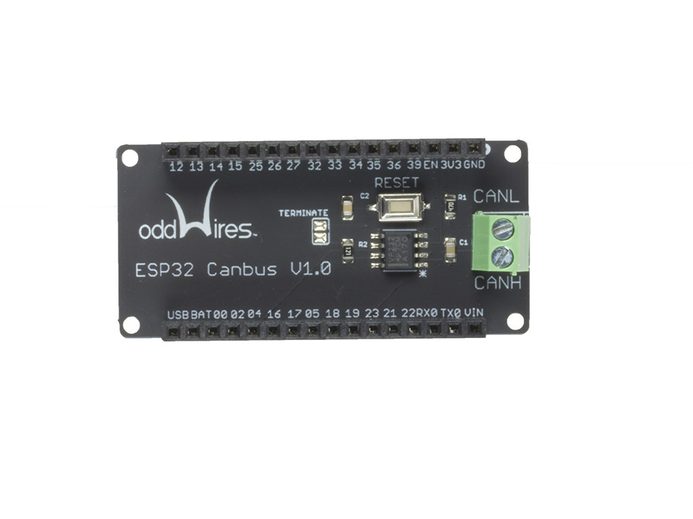

.. _iot-bus-canbus:

CAN Bus
=======

This IoT-Bus module provides CAN Bus capability.
`Vendor information... <http://www.oddwires.com/iot-bus-esp32-io/>`__

.. contents:: Contents
    :local:

Pins Used
---------

.. list-table::
  :header-rows:  1

  * - 4
    - CAN BUs TX
  * - 5
    - CAN Bus RX

.. begin_platforms

Platforms
---------
.. list-table::
    :header-rows:  1

    * - Name
      - Description

    * - :ref:`platform_espressif32`
      - Espressif Systems is a privately held fabless semiconductor company. They provide wireless communications and Wi-Fi chips which are widely used in mobile devices and the Internet of Things applications.

Frameworks
----------
.. list-table::
    :header-rows:  1

    * - Name
      - Description

    * - :ref:`framework_arduino`
      - Arduino Wiring-based Framework allows writing cross-platform software to control devices attached to a wide range of Arduino boards to create all kinds of creative coding, interactive objects, spaces or physical experiences.

    * - :ref:`framework_espidf`
      - Espressif IoT Development Framework. Official development framework for ESP32.

  