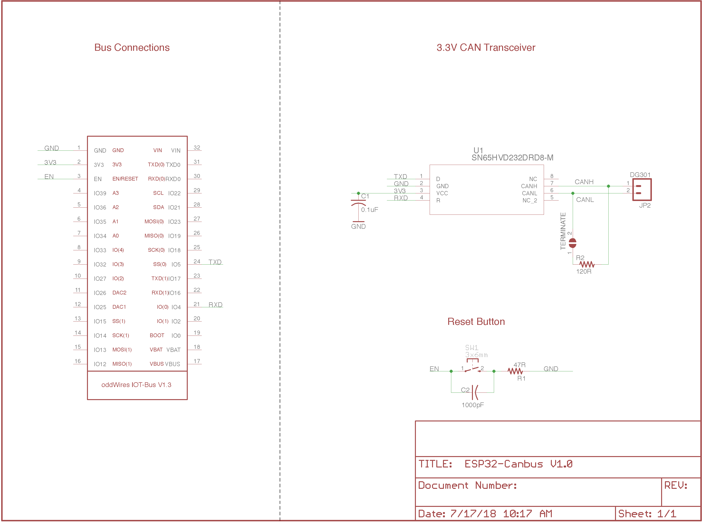

.. _iot-bus-canbus:

CAN Bus
=======

.. image:: ../_static/iot-bus-canbus.jpg
    :align: left
    :alt: CAN Bus
    :scale: 50%
    :width: 100%
    :target: ../_static/iot-bus-canbus.jpg

.. raw:: html
  
    
  

  The IoT-Bus CAN Bus module offers a transceiver that enables you to use the onboard ESP32 CAN controller. You can
  connect the terminals to any required connection.

`Buy it in the oddWires store... <http://www.oddwires.com/iot-bus-esp32-can-bus/>`__

Pins Used
---------

.. list-table::
  :header-rows:  1
  
  * - IOT-Bus Pin
    - Description
  * - 4
    - CAN Bus RXD
  * - 5
    - CAN Bus TXD

.. note:: CAN Bus cannot be used at the same time as LoRa. 

Libraries
---------

.. list-table::
    :header-rows:  1

    *  - Name
       - Framework
       - Description
    *  - `Arduino-CAN <https://github.com/sandeepmistry/arduino-CAN>`_
       - Arduino
       - Sandeep Mistry's Arduino-CAN library
    *  - `Arduino-OBD2 <https://github.com/sandeepmistry/arduino-OBD2>`_
       - Arduino
       - Sandeep Mistry's Arduino-OBD2 library requires Arduino-CAN 

Schematic
---------

Click image to enlarge.

Platforms
---------
.. list-table::
    :header-rows:  1

    * - Name
      - Description

    * - :ref:`platform_espressif32`
      - Espressif Systems is a privately held fabless semiconductor company. They provide wireless communications and Wi-Fi chips which are widely used in mobile devices and the Internet of Things applications.

Frameworks
----------
.. list-table::
    :header-rows:  1

    * - Name
      - Description

    * - :ref:`framework_arduino`
      - Arduino Wiring-based Framework allows writing cross-platform software to control devices attached to a wide range of Arduino boards to create all kinds of creative coding, interactive objects, spaces or physical experiences.

    * - :ref:`framework_espidf`
      - Espressif IoT Development Framework. Official development framework for ESP32.

  