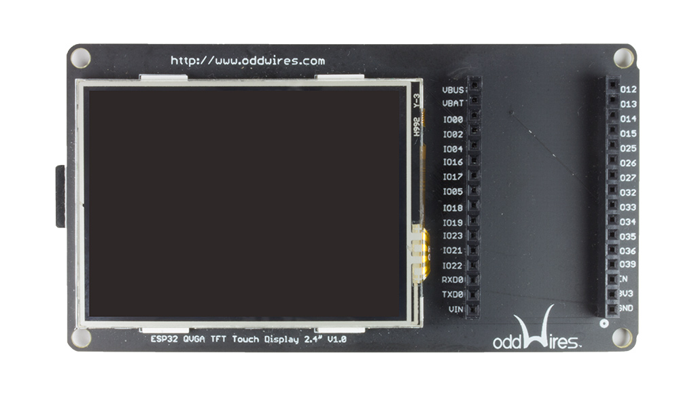

.. _iot-bus-display:

2.4" QVGA Touch Display
=======================

.. raw:: html
  
    
  

This a nice 2.4" 320x240 QVGA TFT Touch Display offering plug and play display output and 
touch sensing together with a 4-bit SDMMC SD Card. We picked 2.4" over 2.8" as it has a crisper 
display at 320 x 240 resolution and its slightly smaller size helps in IoT applications. Designed primarily for 
development use it has an IoT-Bus socket at the side for easy access.  

`Buy it in the oddWires store... <http://www.oddwires.com/iot-bus-qvga-2-4-tft-touch-display/>`__

Pins Used
---------

.. list-table::
  :header-rows:  1

  * - IOT-Bus Pin
    - Description
  * - 2
    - DAT0 (SD Card)
  * - 4
    - DAT1 (SD Card)  
  * - 5
    - SS (TFT) 
  * - 12
    - DAT2 (SD Card)  
  * - 13
    - DAT2 (SD Card)   
  * - 14
    - CLK (SD Card)  
  * - 15
    - CMD (SD)  
  * - 16
    - SS (Touch Screen) 
  * - 17
    - IRQ (Touch Screen) 
  * - 18
    - SCK (TFT)               
  * - 19
    - MISO (TFT) 
  * - 23
    - MOSI (TFT) 
  * - 27
    - DC (TFT) 
  * - 33
    - Backlight (TFT) - you will not see anything if you do not turn on the backlight!
  * - EN
    - RESET (TFT)
  * - 3V3
    - Power
  * - GND
    - Ground

.. note:: 
  This board uses a lot of pins if you are using everything. 
  If you are not using the SDCard then those pins may be freely used. 
  You can also use the SCard in one pin mode freeing up DAT1, DAT2 and DAT3. 
  If you are not using the touch capabilities of the module then you can utilize those pins. 
  IRQ is not used by the forked version of the XPT2046 library freeing up pin 17.
  The current versions of the IoT-Bus CAN Bus and LoRa modules cannot be used with this display.  

Schematic
---------

Libraries
---------

.. list-table::
    :header-rows:  1

    * - Name
      - Description
      - Github Repository

    * - TFTeSPI
      - Bodmer's TFT library has been forked to setup correct user defaults.
      - `TFTeSPI <https://github.com/iot-bus/TFT_eSPI>`_

    * - XPT2046_Touchscreen
      - Paul Stoffgren's XPT2046_Touchscreen library has been forked to disable interrupts and map raw points to 320 x 240.
      - `XPT2046_Touchscreen <https://github.com/iot-bus/XPT2046_Touchscreen>`_     

Platforms
---------

.. list-table::
    :header-rows:  1

    * - Name
      - Description

    * - :ref:`platform_espressif32`
      - Espressif Systems is a privately held fabless semiconductor company. They provide wireless communications and Wi-Fi chips which are widely used in mobile devices and the Internet of Things applications.

Frameworks
----------

.. list-table::
    :header-rows:  1

    * - Name
      - Description

    * - :ref:`framework_arduino`
      - Arduino Wiring-based Framework allows writing cross-platform software to control devices attached to a wide range of Arduino boards to create all kinds of creative coding, interactive objects, spaces or physical experiences.

    * - :ref:`framework_espidf`
      - Espressif IoT Development Framework. Official development framework for ESP32.

  