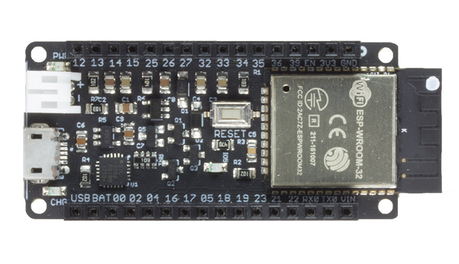

.. _iot-bus-io:

Io
==

.. raw:: html
  
    

Very small and breadboard-friendly with option of male, female or both (stackable headers). Includes a dual-core 240 MHz ESP32 with 
WiFi and Bluetooth. You can use the WiFi both in station (device) mode and access point mode. It includes traditional Bluetooth as well as BLE 4.0. 

On-board is a 3.3V regulator and a battery charging device that enables you to switch between using USB or battery power. The battery
is automatically charged in the USB is plugged in. A status light shows if it is charging or fully charged. All ESP32 pins bar the flash pins are exposed 
and available for your use.

`Buy it in the oddWires store... <https://www.oddwires.com/io/>`__

Pins Used
---------

.. list-table::
  :header-rows:  1

  * - IOT-Bus Pin
    - Description
  * - 5
    - On-board LED

.. note:: Pin 5 is the default SS for the vSPI interface and provided you are not using 
them at the same time it will work just fine for either purpose.

Schematic
---------

.. image:: ../_static/iot-bus-io-v1.0d-schematic.png
    :align: left
    :alt: IoT-Bus Io Schematic
    :scale: 8%
    :target: ../_static/iot-bus-io-v1.0d-schematic.png

.. raw:: html
  
    
     

Platforms
---------
.. list-table::
    :header-rows:  1

    * - Name
      - Description

    * - :ref:`platform_espressif32`
      - Espressif Systems is a privately held fabless semiconductor company. They provide wireless communications and Wi-Fi chips which are widely used in mobile devices and the Internet of Things applications.

Frameworks
----------
.. list-table::
    :header-rows:  1

    * - Name
      - Description

    * - :ref:`framework_arduino`
      - Arduino Wiring-based Framework allows writing cross-platform software to control devices attached to a wide range of Arduino boards to create all kinds of creative coding, interactive objects, spaces or physical experiences.

    * - :ref:`framework_espidf`
      - Espressif IoT Development Framework. Official development framework for ESP32.

  