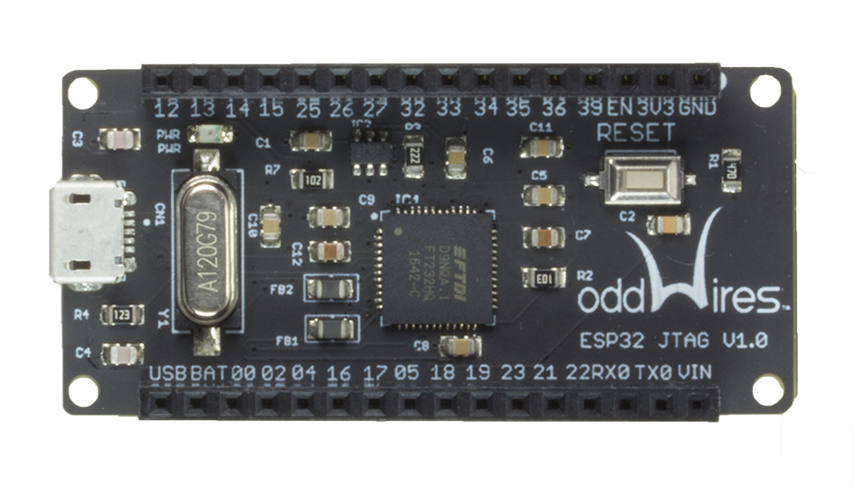

.. _iot-bus-jtag:

JTAG
====

This IoT-Bus module provides JTAG debugging for the
:ref:`board_espressif32_iotbusio` and :ref:`board_espressif32_iotbusproteus`
boards (can be used with other boards too, see wiring connections below).
The board uses the FT232H to provide a USB controller with JTAG
support. Both debugging and flashing is possible using this port.
`Vendor information... <http://www.oddwires.com/iot-bus-esp32-jtag/?utm_source=platformio&utm_medium=docs>`__

.. contents:: Contents
    :local:

Configuration
-------------

You can configure debugging tool using :ref:`projectconf_debug_tool` option in
:ref:`projectconf`:

.. code-block:: ini

    [env:myenv]
    platform = ...
    board = ...
    debug_tool = iot-bus-jtag

If you would like to use this tool for firmware uploading, please change
upload protocol:

.. code-block:: ini

    [env:myenv]
    platform = ...
    board = ...
    debug_tool = iot-bus-jtag
    upload_protocol = iot-bus-jtag

More options:

* :ref:`projectconf_section_env_debug`
* :ref:`projectconf_section_env_upload`

.. include:: _common_jtag_drivers.rst

Wiring Connections
------------------

.. list-table::
  :header-rows:  1

  * - IOT-Bus JTAG Pin
    - Board JTAG Pin
    - Description
  * - 2
    - VCC
    - Positive Supply Voltage — Power supply for JTAG interface drivers
  * - 1
    - GND
    - Digital ground
  * - 16
    - TDI
    - Test Data In pin
  * - 14
    - TMS
    - Test Mode State pin
  * - 15
    - TCK
    - JTAG Return Test ClocK
  * - 13
    - TDO
    - Test Data Out pin
  * - 3
    - RESET
    - Connect this pin to the (active low) reset input of the target CPU

.. begin_platforms

Platforms
---------
.. list-table::
    :header-rows:  1

    * - Name
      - Description

    * - :ref:`platform_espressif32`
      - Espressif Systems is a privately held fabless semiconductor company. They provide wireless communications and Wi-Fi chips which are widely used in mobile devices and the Internet of Things applications.

Frameworks
----------
.. list-table::
    :header-rows:  1

    * - Name
      - Description

    * - :ref:`framework_arduino`
      - Arduino Wiring-based Framework allows writing cross-platform software to control devices attached to a wide range of Arduino boards to create all kinds of creative coding, interactive objects, spaces or physical experiences.

    * - :ref:`framework_espidf`
      - Espressif IoT Development Framework. Official development framework for ESP32.

    * - :ref:`framework_simba`
      - Simba is an RTOS and build framework. It aims to make embedded programming easy and portable.

