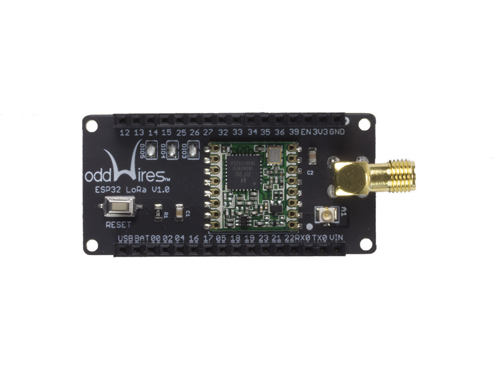

.. _iot-bus-lora:

LoRa
=====

.. raw:: html
  
    
  

This IoT-Bus module utilizes the Hope RFM95 to offer low-cost, LoRa radio transmission and a Wi-Fi/LoRa gateway.
The RFM95W transceivers  feature  the  LoRaTM  long range modem that provides ultra-long range spread spectrum communication and high interference immunity whilst minimizing current consumption.

Using Hope RF’s patented LoRaTM modulation technique RFM95W can achieve a sensitivity of over -148dBm using a low cost crystal and bill of materials. The high sensitivity combined with the integrated +20 dBm power amplifier yields  industry  leading  link  budget  making  it optimal for any application requiring range or robustness. LoRaTM also provides significant advantages in both blocking and selectivity over conventional modulation techniques, solving the traditional design compromise between range, interference immunity and energy consumption.
These devices also support high performance (G)FSK modes for systems including WMBus, IEEE802.15.4g. The RFM95W deliver exceptional phase noise, selectivity, receiver linearity  and  IIP3  for  significantly lower  current consumption than competing devices.
 
Features of RF Transceiver LoRa Module RFM95W:
 
* LoRaTM Modem.
* 915 MHz
* 168 dB maximum link budget.
* +20 dBm - 100 mW constant RF output vs. V supply.
* +14 dBm high efficiency PA.
* Programmable bit rate up to 300 kbps.
* High sensitivity: down to -148 dBm.
* Bullet-proof front end: IIP3 = -12.5 dBm.
* Excellent blocking immunity.
* Low RX current of 10.3 mA, 200 nA register retention.
* Fully integrated synthesizer with a resolution of 61 Hz.
* FSK, GFSK, MSK, GMSK, LoRaTM and OOK modulation.
* Built-in bit synchronizer for clock recovery.
* Preamble detection.
* 127 dB Dynamic Range RSSI.
* Automatic RF Sense and CAD with ultra-fast AFC.
* Packet engine up to 256 bytes with CRC.
* Built-in temperature sensor and low battery indicator.
* Modue Size：16* 16mm
 
Potential Applications of the RF Transceiver Module RFM95W:
 
* Automated Meter Reading.
* Home and Building Automation.
* Wireless Alarm and Security Systems.
* Industrial Monitoring and Control
* Long range Irrigation Systems

`See it in the oddWires store... <http://www.oddwires.com/iot-bus-lora/>`__

.. contents:: Contents
    :local:

Pins Used
---------

.. list-table::
  :header-rows:  1

  *  - IOT-Bus Pin
    - Description
  *  - X
    - TBD

.. begin_platforms

Platforms
---------
.. list-table::
    :header-rows:  1

    *  - Name
      - Description

    *  - :ref:`platform_espressif32`
      - Espressif Systems is a privately held fabless semiconductor company. They provide wireless communications and Wi-Fi chips which are widely used in mobile devices and the Internet of Things applications.

Frameworks
----------
.. list-table::
    :header-rows:  1

    *  - Name
      - Description

    *  - :ref:`framework_arduino`
      - Arduino Wiring-based Framework allows writing cross-platform software to control devices attached to a wide range of Arduino boards to create all kinds of creative coding, interactive objects, spaces or physical experiences.

    *  - :ref:`framework_espidf`
      - Espressif IoT Development Framework. Official development framework for ESP32.

  