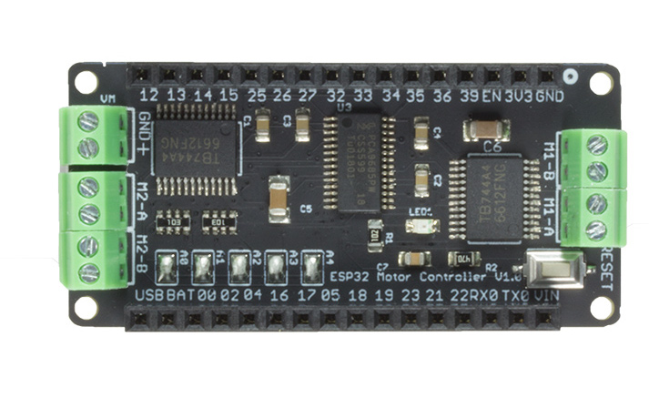

.. _iot-bus-motor:

Motor
=====

.. raw:: html
  
    
    

  This IoT-Bus module provides a motor controller. It uses two TB6612FNG motor drivers controlled by a PCA9685 on the I2C bus. 
  The default address is 0x5F but can be changed from 0x40 through 0x5F by disconnecting solder blobs. It supports two stepper motors or four DC Motors.

`Buy it in the oddWires store... <http://www.oddwires.com/iot-bus-motor-controller/>`__

Pins Used
---------

.. list-table::
  :header-rows:  1

  * - IOT-Bus Pin
    - Description
  * - 21
    - SDA
  * - 22
    - SCL  
  * - 3V3
    - Power
  * - GND
    - Ground  

Libraries
---------

.. list-table::
    :header-rows:  1

    *  - Name
       - Framework
       - Description
    *  - `Adafruit_Motor_Shield_V2_Library <https://github.com/adafruit/Adafruit_Motor_Shield_V2_Library>`_
       - Arduino
       - Adafruit V2 Motor Shield library    

Schematic
---------

Click image to enlarge. 

Platforms
---------
.. list-table::
    :header-rows:  1

    * - Name
      - Description

    * - :ref:`platform_espressif32`
      - Espressif Systems is a privately held fabless semiconductor company. They provide wireless communications and Wi-Fi chips which are widely used in mobile devices and the Internet of Things applications.

Frameworks
----------
.. list-table::
    :header-rows:  1

    * - Name
      - Description

    * - :ref:`framework_arduino`
      - Arduino Wiring-based Framework allows writing cross-platform software to control devices attached to a wide range of Arduino boards to create all kinds of creative coding, interactive objects, spaces or physical experiences.

    * - :ref:`framework_espidf`
      - Espressif IoT Development Framework. Official development framework for ESP32.

  