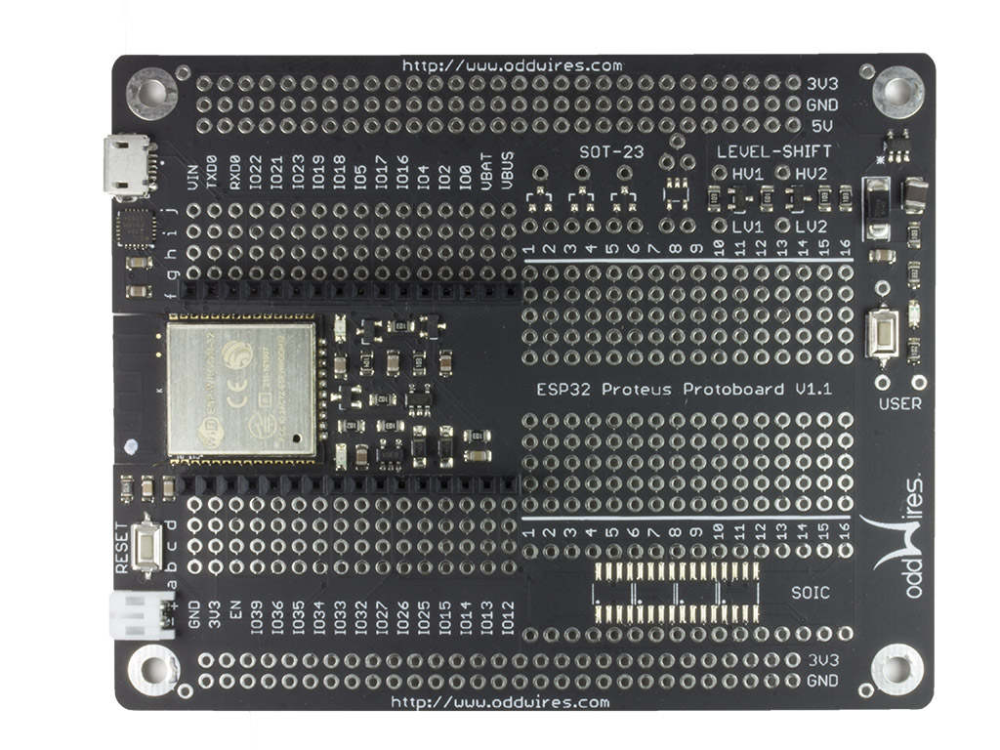
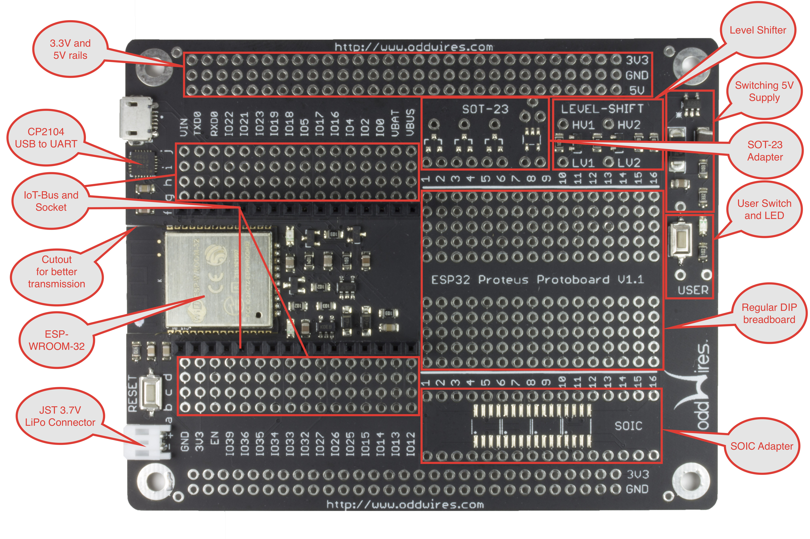

.. _iot-bus-proteus:

Proteus
=======

.. raw:: html
  
  
    

This board is larger and designed to make it possible to add your own circuitry to make a complete IoT solution on one board.
It includes a dual-core 240 MHz ESP32 with WiFi and Bluetooth. You can use the WiFi both in station (device) mode and access point mode. 
It includes traditional Bluetooth as well as BLE 4.0. On-board is a 3.3V regulator and a battery charging device that enables you 
to switch between using USB or battery power. 
  
The battery is automatically charged in the USB is plugged in. A status light shows if it is charging or fully charged. All ESP32 pins bar the flash pins are exposed 
and available for your use. 

.. raw:: html
  
  
  
  
The board includes a large prototyping area that includes room for traditional DIP and through-hole components as well 
as SMD parts such as SOIC and  SOT-23. A user LED and switch is included but not connected to any pins so you can use them how you wish. Two level shifters are included 
so you can interface with 5V devices. 
  
The Proteus includes both 3.3V and 5V rails. Both these rails are available whether powered by the USB or the battery 
as the 5V is derived from the lower voltage. 

`Buy it in the oddWires store... <http://www.oddwires.com/proteus-iot-bus-esp32-microprocessor-wi-fi-and-bluetooth-with-prototype-board-form-factor/>`__

Pins Used
---------

.. list-table::
  :header-rows:  1
  :widths: 20 80

  * - Pin
    - Description
  
  * - None
    - No pins are utilized by the Proteus board 

Libraries
---------

This is not an exhaustive list of libraries available for IoT-Bus but it is a useful list of 
some of the libraries we have used and especially those we have used for examples. The license for each of the libraries 
can be found on each library's GitHub page.

.. list-table::
    :header-rows:  1
    :widths: 20 15 15 50

    *  - Name
       - Board
       - Framework
       - Description
    *  - `webthing-arduino <https://github.com/mozilla-iot/webthing-arduino>`_
       - Io/Proteus
       - Arduino
       - Simple server for WiFi101, ESP8266, or ESP32 boards compliant with Mozilla's proposed WoT API
    *  - `ESPAsyncWebServer <https://github.com/me-no-dev/ESPAsyncWebServer>`_
       - Io/Proteus
       - Arduino
       - Asynchronous HTTP and WebSocket Server for ESP32
    *  - `ArduinoJson <https://github.com/bblanchon/ArduinoJson>`_
       - Io/Proteus
       - Arduino
       - C++ JSON library for IoT. Simple and efficient.
    *  - `arduino-Lora <https://github.com/sandeepmistry/arduino-LoRa>`_
       - LoRa
       - Arduino
       - Sandeep Mistry's arduino-LoRa library 
    *  - `Arduino-CAN <https://github.com/sandeepmistry/arduino-CAN>`_
       - CAN Bus
       - Arduino
       - Sandeep Mistry's Arduino-CAN library
    *  - `Arduino-OBD2 <https://github.com/sandeepmistry/arduino-OBD2>`_
       - CAN Bus
       - Arduino
       - Sandeep Mistry's Arduino-OBD2 library requires Arduino-CAN        
    * - `Adafruit_ILI9341 <https://github.com/adafruit/Adafruit_ILI9341>`_
      - Display
      - Arduino
      - Adafruit's ILI9341 library - use with Adafruit-GFX-Library.
    * - `Adafruit-GFX-Library <https://github.com/adafruit/Adafruit-GFX-Library>`_
      - Display
      - Arduino
      - Adafruit's general purpose graphics library.
    * - `TFTeSPI <https://github.com/iot-bus/TFT_eSPI>`_
      - Display
      - Arduino
      - Bodmer's TFT library has been forked to setup defaults.
    * - `XPT2046_Touchscreen <https://github.com/iot-bus/XPT2046_Touchscreen>`_
      - Display
      - Arduino
      - Fork of Paul Stoffgren's XPT2046_Touchscreen library.
    * - `ESP32_TFT_library <https://github.com/loboris/ESP32_TFT_library>`_
      - Display
      - esp-idf
      - loboris TFT library for ESP32    
    * - `Adafruit_Motor_Shield_V2_Library <https://github.com/adafruit/Adafruit_Motor_Shield_V2_Library>`_
      - Motor
      - Arduino
      - Adafruit V2 Motor Shield library       
    * - `esp-mqtt <https://github.com/espressif/esp-mqtt>`_
      - Io/Proteus
      - esp-idf
      - Espressif MQTT library          
    * - `esp-idf-lib <https://github.com/UncleRus/esp-idf-lib>`_
      - IO/Proteus
      - esp-idf
      - UncleRus components for esp-idf framework. Mostly ports from 
        `esp-open-rtos <https://github.com/SuperHouse/esp-open-rtos>`_

esp-idf-lib Components
----------------------

.. list-table::
    :header-rows:  1
    :widths: 20 60 10 10 

    *  - Component
       - Description
       - License
       - Thread safety

    *  - i2cdev
       - I2C utilities
       - MIT
       - Yes      
    
    *  - ds1307
       - Driver for DS1307 RTC module 
       - BSD
       - Yes

    *  - ds3231
       - Driver for DS3231 high precision RTC module 
       - MIT
       - Yes

    *  - hmc5883l
       - Driver for HMC5883L 3-axis digital compass
       - BSD
       - Yes

    *  - onewire
       - Bit-banging one wire driver  
       - MIT*
       - No

    *  - ds18x20
       - Driver for DS18B20/DS18S20 families of one-wire temperature sensor ICs
       - BSD
       - No

    *  - dht
       - Driver for DHT11/DHT22 temperature and humidity sensors
       - BSD
       - No

    *  - bmp180
       - Driver for BMP180 digital pressure sensor
       - MIT
       - Yes

    *  - bmp280
       - Driver for BMP280/BME280 digital pressure sensor
       - MIT
       - Yes

    *  - bh1750 
       - Driver for BH1750 light sensor 
       - BSD
       - Yes   

    *  - ultrasonic
       - Driver for ultrasonic range meters, e.g. HC-SR04, HY-SRF05 
       - BSD 
       - No                                               

    *  - pcf8574 
       - Driver for PCF8574 remote 8-bit I/O expander for I2C-bus  
       - MIT
       - Yes                                               

    *  - hd44780
       - Universal driver for HD44780 LCD display   
       - BSD
       - No                                               

    *  - pca9685 
       - Driver for 16-channel, 12-bit PWM PCA9685  
       - BSD
       - Yes   

    *  - ms5611  
       - Driver for barometic pressure sensor MS5611-01BA03 
       - BSD
       - Yes                                             

    *  - ads111x 
       - Driver for ADS1113/ADS1114/ADS1115 I2C ADC     
       - BSD
       - Yes                                              

    *  - pcf8591
       - Driver for 8-bit ADC and an 8-bit DAC PCF8591  
       - BSD
       - Yes                                              

    *  - tsl2561 
       - Driver for light-to-digital converter TSL2561   
       - BSD
       - Yes   

    *  - max7219
       - Driver for 8-Digit LED display drivers, MAX7219/MAX7221 
       - BSD
       - Yes                                              

    *  - mcp23017 
       - Driver for 16-bit I2C GPIO expander   
       - BSD
       - Yes                                             

    *  - tda74xx 
       - Driver for TDA7439/TDA7439DS/TDA7440D audio-processors     
       - MIT
       - Yes    

Schematic
---------

.. image:: ../_static/iot-bus-proteus-v1.1-schematic.png
    :align: left
    :alt: IoT-Bus Io Schematic
    :scale: 7%
    :target: ../_static/iot-bus-proteus-v1.1-schematic.png  

Platforms
---------
.. list-table::
    :header-rows:  1

    * - Name
      - Description

    * - :ref:`platform_espressif32`
      - Espressif Systems is a privately held fabless semiconductor company. 
        They provide wireless communications and Wi-Fi chips which are widely used in mobile devices and the 
        Internet of Things applications.

Frameworks
----------
.. list-table::
    :header-rows:  1

    * - Name
      - Description

    * - :ref:`framework_arduino`
      - Arduino Wiring-based Framework allows writing cross-platform 
        software to control devices attached to a wide range of Arduino boards to 
        create all kinds of creative coding, interactive objects, spaces or physical experiences.

    * - :ref:`framework_espidf`
      - Espressif IoT Development Framework. Official development framework for ESP32.

