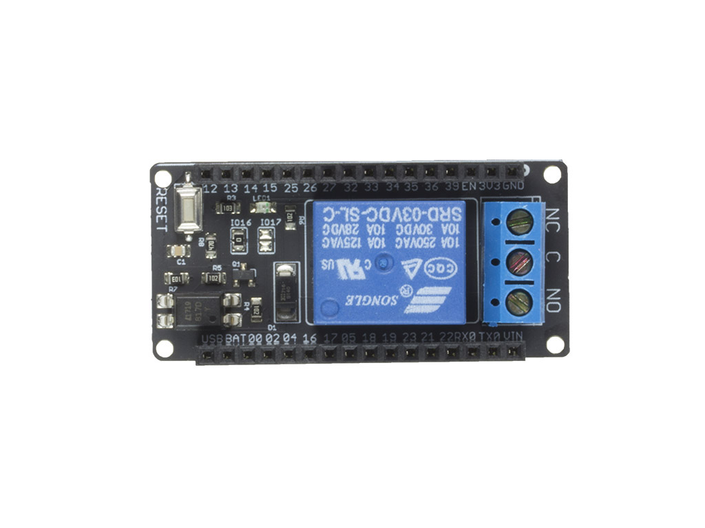
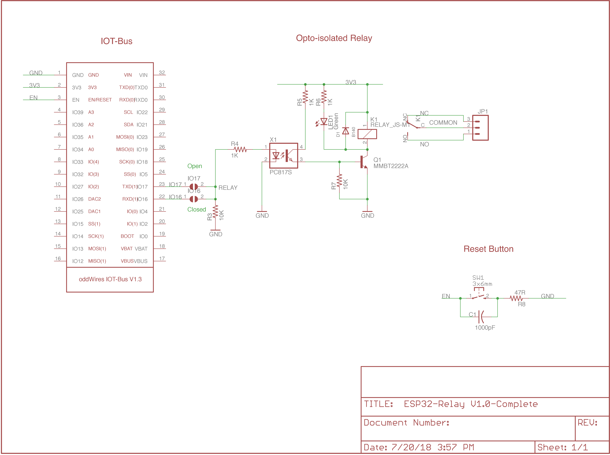

.. _iot-bus-relay:

Relay
=====

.. raw:: html
  
    
     

This is an opto-isolated relay board driven by a single digital pin.
It is a 110V, 10A maximum AC relay board in the IoT-Bus form factor.

`Buy it in the oddWires store... <http://www.oddwires.com/iot-bus-relay/>`__

Pins Used
---------

.. list-table::
  :header-rows:  1

  * - IOT-Bus Pin
    - Description
  * - 17 
    - Relay

Schematic
---------

Click image to enlarge.    

Platforms
---------
.. list-table::
    :header-rows:  1

    * - Name
      - Description

    * - :ref:`platform_espressif32`
      - Espressif Systems is a privately held fabless semiconductor company. They provide wireless communications and Wi-Fi chips which are widely used in mobile devices and the Internet of Things applications.

Frameworks
----------
.. list-table::
    :header-rows:  1

    * - Name
      - Description

    * - :ref:`framework_arduino`
      - Arduino Wiring-based Framework allows writing cross-platform software to control devices attached to a wide range of Arduino boards to create all kinds of creative coding, interactive objects, spaces or physical experiences.

    * - :ref:`framework_espidf`
      - Espressif IoT Development Framework. Official development framework for ESP32.

  