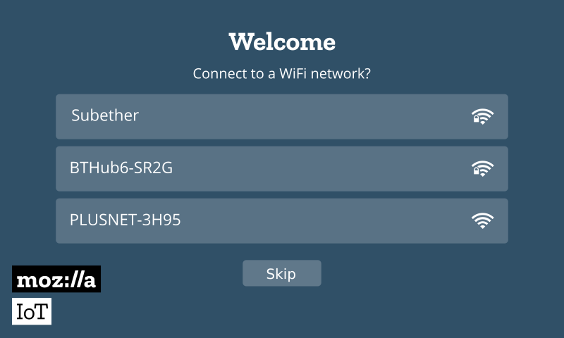
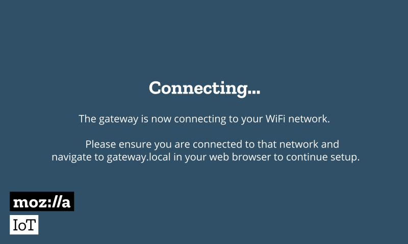
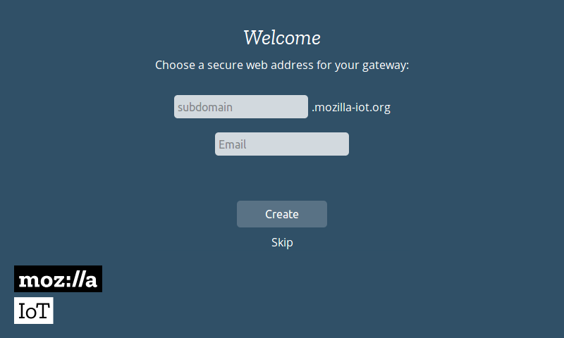
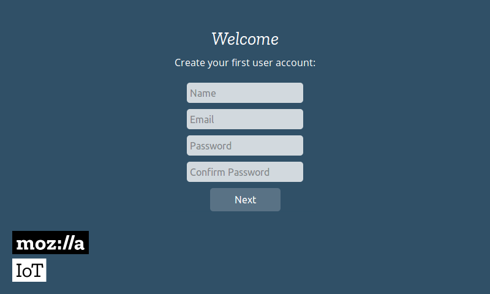
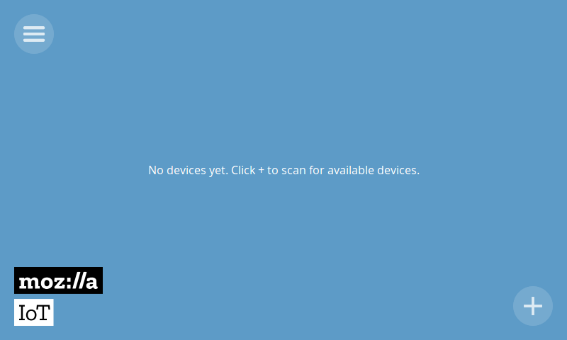

.. _getting-started-with-mozilla-iot:

Getting Started with Mozilla IoT
================================

You will need a Raspberry Pi an SD Card and an IoT-Bus Io board. If you buy a Mozilla IoT Starter Kit from oddWires you will have everything you need. 

1. Install and setup the Mozilla IoT gateway on a Raspberry Pi.

2. Install your IDE. We are going to use PlatformIo. See the section on Getting Started with PlatformIO for details.

3. Get the IoT-Bus examples from Github. Download or clone them from here. 

4. We are going to use the Arduino framework in conjunction with Mozilla IoT to turn the board LED on and off.

If you didn't buy a Mozilla IoT get from oddWires which includes an Sd Card flashed with the Mozilla IoT Gateway you will need to download gateway image as a zip file from here. 
Expand it and flash it onto an SD Card using a product like `etcher <https://www.balena.io/etcher/>`_. 

Gateway First Time Setup
------------------------

Place it into your Raspberry Pi and power up. The image 
is enabled for WiFi and will create an access point "Mozilla IoT Gateway". You can connect to that WiFi hot-spot with your laptop or 
smartphone which should automatically direct you to a setup page which looks like this:

Choose to connect to a WiFi network and you’ll be prompted for the WiFi password. The gateway will connect to that network and 
then you’ll need to make sure you’re connected to that same network in order to continue setup. 
If you're directly connected via ethernet you do not need to do this.

Next, you’ll be asked to choose a unique subdomain for your gateway, which will automatically generate an SSL certificate for you using LetsEncrypt and set up a secure tunnel to the Internet so you can access the gateway remotely. 
You’ll be asked for an email address so you can reclaim your subdomain in future if necessary. You can also choose 
your own domain name if you don’t want to use the tunneling service, but you’ll need to generate your own 
SSL certificate and configure DNS yourself.

This is the screen you will see:

You will then be securely redirected to your new subdomain and you’ll be prompted to create your user account on the gateway.

You’ll then automatically be logged into the gateway and will be ready to start adding things. Note that the gateway’s web 
interface is a Progressive Web App that you can add to home-screen on your smartphone with Firefox.
Now you should see this screen and the gateway is ready to add Things.

Adding Things
-------------

You are now ready to add Things. To add devices to your gateway, click on the “+” icon at the bottom right of the screen. 
This will put all the attached adapters into pairing mode. Follow the instructions for your individual device to pair it with the gateway 
(this often involves pressing a button on the device while the gateway is in pairing mode).

Devices that have been successfully paired with the gateway will appear in the add device 
screen and you can give them a name of your choice before saving them on the gateway.

Now let's create a Thing and add it to the gateway.

Creating a Thing
----------------

From wherever you installed the IoT-Bus examples, open up the LED example, edit to to change the network *ssid* and *password*  and run it. When you click on the “+” icon in the lower right corner of the gateway screen the gateway should discover 
the LED Thing. 

.. image:: ../_static/mozilla_add_things.png
    :align: center
    :alt: Mozilla Add Things
    :width: 100%

Save it and click Done. You should now be able to click on the thing an get a display like this:

.. image:: ../_static/mozilla_led.png
    :align: center
    :alt: Mozilla LED
    :width: 100%

The LED should respond to you turning it off and on in the Mozilla IoT interface! See many other Mozilla IoT examples here.    