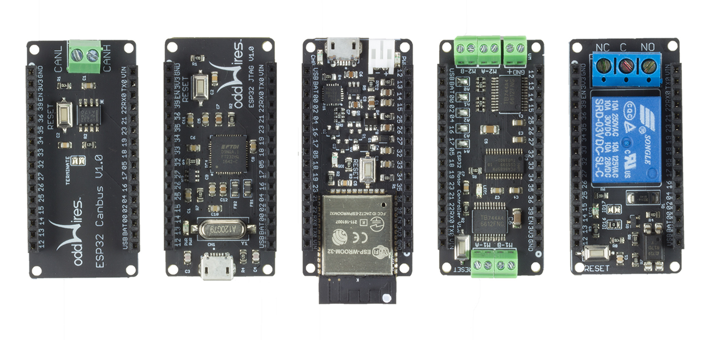
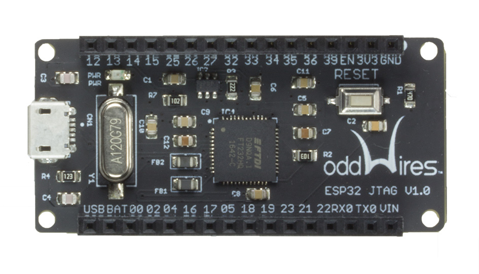
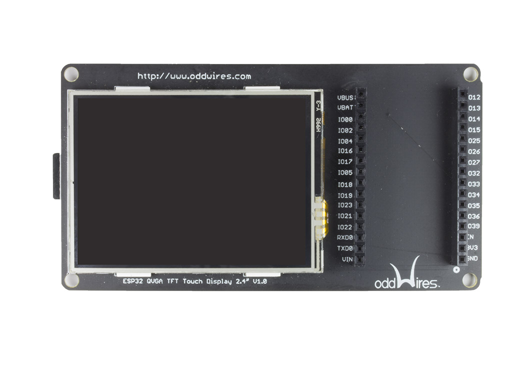

.. _iot-bus-overview:

Iot-Bus Overview
================

The oddWires IoT-Bus system is based on a low-cost, open design that includes multiple main boards 
including a minimalist, breadboard-friendly form-factor, the IoT-Bus Io and a
version with a large prototyping area which enables a single-board IoT solution, the Proteus. 

The IoT-Bus is designed to be "plug and play" - the new range of oddWires open IoT-Bus boards use the 
Espressif ESP32 microprocessor (240Mhz, 32-bit, 4MB) for rapid, low-cost IoT development and deployment. 

Our aim is to provide an open platform, easy to adopt and build on, adaptable, tested, with many solutions already available.
There are no lock-in costs, and overall it provide a low-cost solution for faster development of professional, 
educational and hobbyist applications. 

A variety of programming languages, environments and frameworks that work right out of the box with IoT-Bus and PlatformIO
supports most of them in a professional or serious educational or hobby environment. You can use either the esp-idf framework 
for a professional multi-tasking system based on freeRTOS or the popular Arduino environment for simplicity.

So take your choice! Other platforms include javascript by moddable, python by Micropython, or the mongoose server.

    Some IoT-Bus Boards

IoT-Bus System
--------------

* Open Design
* Low-cost
*	Plug and Play, Expandable
*	Powerful 240MHz, 32-bit Processor with 4Mb of Flash Memory
*	Multiple Form Factor Main Boards (Io, Proteus) 
*	Connected in Many Ways (Wi-Fi, Bluetooth, BLE 4.0. LoRa and Canbus available options)
*	Integrated 2.4" Touch TFT QVGA Display Available 
* Solderable Prototype Board with Controller
*	IOT-Ready, Relay and Motor Controller
*	Multiple open platforms
*	Supports C++, Micropython and javascript

At the heart of the system is an ESP32 processor providing two SPI and an I2C interface with plenty of general purpose I/O. 
The Espressif ESP-WROOM-32 has been selected as the microcontroller enabling very low-cost deployment of production IoT devices. 
It offers 240Mhz, 32-bit processing with 4MB of flash as standard.

The first controller boards drive relays and motors and there are a wide range of connectivity options including
Wi-Fi, Bluetooth, CAN Bus, and LoRa.

Developing open IoT applications means being able to see the schematics for the hardware, using open tools,
frameworks and platforms and very importantly the cloud you use has to be open.

Mozilla Project Things - An Open Internet of Things
---------------------------------------------------

Internet of Things (IoT) devices have become more popular over the last few years, 
but there is no single standard for how these devices should talk to each other. 
Each vendor typically creates a custom application that only works with their own brand. 
If the future of connected IoT devices continues to involve proprietary solutions, then costs will stay high, 
while the market remains fragmented and slow to grow. Consumers should not be locked into a specific product, 
brand, or platform. This will only lead to paying premium prices for something as simple as a “smart light bulb”.

We are aligned with mozilla and believe the future of connected devices should be more like the open web. 
The future should be decentralized, and should put the power and control into the hands of the people 
who use those devices. This is why we are committed to supporting open standards and frameworks.

We are partnering with mozilla to offer kits that can be used to quickly integrate with mozilla-iot. 
Watch this space for more details. We have also created many examples using iot-bus with mozilla-iot.
`See our examples on github <https://github.com/iot-bus/iot-bus-mozilla-iot-examples>`_. 

Two main-board form-factors
---------------------------

`Io <boards/iot-bus-io.html>`_
  Very small and breadboard-friendly with option of male, female or both (stackable headers). Includes a dual-core 240 MHz ESP32 with 
  WiFi and Bluetooth. You can use the WiFi both in station (device) mode and access point mode. It includes traditional Bluetooth as well as BLE 4.0. 
  
  On-board is a 3.3V regulator and a battery charging device that enabled you to switch between using USB or battery power. The battery
  is automatically charged in the USB is plugged in. A status light shows if it is charging or fully charged. All ESP32 pins bar the flash pins are exposed 
  and available for your use.

  .. figure:: _static/iot-bus-io.jpg
      :align: left
      :alt: Io Board
      :scale: 50%
      :figclass: align-center
      :target: boards/iot-bus-io.html

      Io 

.. raw:: html
  
    

`Proteus <boards/iot-bus-proteus.html>`_
  This board is larger and designed to make it possible to add your own circuitry to make a complete IoT solution on one board.
  It includes a dual-core 240 MHz ESP32 with WiFi and Bluetooth. You can use the WiFi both in station (device) mode and access point mode. 
  It includes traditional Bluetooth as well as BLE 4.0. On-board is a 3.3V regulator and a battery charging device that enabled you 
  to switch between using USB or battery power. 
  
  The battery
  is automatically charged in the USB is plugged in. A status light shows if it is charging or fully charged. All ESP32 pins bar the flash pins are exposed 
  and available for your use. 
  
  The board includes a large prototyping area that includes room for traditional DIP and through-hole components as well 
  as SMD parts such as SOIC and  SOT-23. A user LED and switch is included but not connected to any pins so you can use them how you wish. Two level shifters are included 
  so you can interface with 5V devices. 
  
  The Proteus includes both 3.3V and 5V rails. Both these rails are available whether powered by the USB or the battery 
  as the 5V is derived from the lower voltage. 

  .. figure:: _static/iot-bus-proteus.jpg
      :align: left
      :alt: Proteus Board
      :scale: 50%
      :figclass: align-center
      :target: boards/iot-bus-proteus.html

      Proteus 

.. raw:: html
    
  
    

`JTAG <boards/iot-bus-jtag.html>`_
----------------------------------
Both the Io and Proteus processor boards can accept a specially designed JTAG board offering 
hardware debugging. Our JTAG board is based on the FT232H and it enables comprehensive JTAG debugging support. 
You can use OpenOCD and GDB in combination to use it but our recommendation is to use PlatformIO. 
PlatformIO has taken away all the hard work of configuring OpenOCD and GDB. You simply select it is your debugging choice as described 
`here <https://docs.platformio.org/en/latest/plus/debug-tools/iot-bus-jtag.html>`_. 
Take a look at how easy it is to use with `PlatformIO's Unified Debugger <https://docs.platformio.org/en/latest/plus/debugging.html>`_. 
Just plug it in and start debugging! No more printing to the terminal!

    JTAG 
    
.. raw:: html
  
    
  

`2.4" QVGA TFT Touch Display <boards/iot-bus-display.html>`_
------------------------------------------------------------

This a nice 2.4" 320x240 QVGA TFT Touch Display offering plug and play display output and 
touch sensing together with a 4-bit SDMMC SD Card. We picked 2.4" over 2.8" as it has a crisper 
display at 320 x 240 resolution and its slightly smaller size helps in IoT applications. Designed primarily for 
development use it has an IoT-Bus socket at the side.  

    2.4" QVGA Touch Display
    

.. raw:: html
  
    
      

Two Additional Connectivity Options
-----------------------------------

`CAN Bus <boards/iot-bus-canbus.html>`_
  The IoT-Bus CAN Bus module offers a transceiver that enables you to use the onboard ESP32 CAN controller. You can
  connect the terminals to any required connection.

  .. figure:: _static/iot-bus-canbus.jpg
      :align: left
      :alt: CAN Bus
      :scale: 50%
      :figclass: align-center
      :target: boards/iot-bus-canbus.html

      CAN Bus

.. raw:: html
  
    
      

`LoRa <boards/iot-bus-lora.html>`_
  This IoT-Bus module utilizes the Hope RFM95 to offer low-cost, LoRa radio transmission and a Wi-Fi/LoRa gateway. 
  It uses the correct 915 MHz rather than the 433 MHz european standard often found.
  The RFM95W transceivers feature the LoRa long range modem that provides ultra-long range spread spectrum 
  communication and high interference immunity whilst minimizing current consumption.

  Using Hope RF’s patented LoRa modulation technique RFM95W can achieve a sensitivity of over -148dBm using a 
  low cost crystal and bill of materials. The high sensitivity combined with the integrated +20 dBm power 
  amplifier yields industry-leading link budget  making it optimal for any application requiring range or robustness. 
  
  LoRa™ also provides significant advantages in both blocking and selectivity over conventional modulation techniques, 
  solving the traditional design compromise between range, interference immunity and energy consumption.
  These devices also support high performance (G)FSK modes for systems including WMBus, IEEE802.15.4g. 
  The RFM95W deliver exceptional phase noise, selectivity, receiver linearity and IIP3 
  for significantly lower  current consumption than competing devices.

  .. figure:: _static/iot-bus-lora.jpg
      :align: left
      :alt: LoRa
      :scale: 50%
      :figclass: align-center
      :target: boards/iot-bus-lora.html

      LoRa™

.. raw:: html
  
    
      

Two Controller Boards
---------------------

`Relay <boards/iot-bus-relay.html>`_
  This is an opto-isolated relay board driven by a single digital pin. It is a 110V, 10A maximum AC relay board in the IoT-Bus form factor.
  
  .. figure:: _static/iot-bus-relay.jpg
      :align: left
      :alt: Relay
      :scale: 50%
      :figclass: align-center
      :target: boards/iot-bus-relay.html

      Relay

.. raw:: html
  
    
      

`Motor <boards/iot-bus-motor.html>`_
  This IoT-Bus module provides a motor controller. It uses two TB6612FNG motor drivers controlled by a PCA9685 on the I2C bus. 
  It supports two stepper motors or four DC Motors.

  .. figure:: _static/iot-bus-motor.jpg
      :align: left
      :alt: Motor
      :scale: 50%
      :figclass: align-center
      :target: boards/iot-bus-motor.html

      Motor

.. raw:: html
  
    
      

Platforms
---------
.. list-table::
    :header-rows:  1

    * - Name
      - Description

    * - :ref:`platform_espressif32`
      - Espressif Systems is a privately held fabless semiconductor company. They provide wireless communications and Wi-Fi chips which are widely used in mobile devices and the Internet of Things applications.

Frameworks
----------
.. list-table::
    :header-rows:  1

    * - Name
      - Description

    * - :ref:`framework_arduino`
      - Arduino Wiring-based Framework allows writing cross-platform software to control devices attached to a wide range of Arduino boards to create all kinds of creative coding, interactive objects, spaces or physical experiences.

    * - :ref:`framework_espidf`
      - Espressif IoT Development Framework. Official development framework for ESP32.

