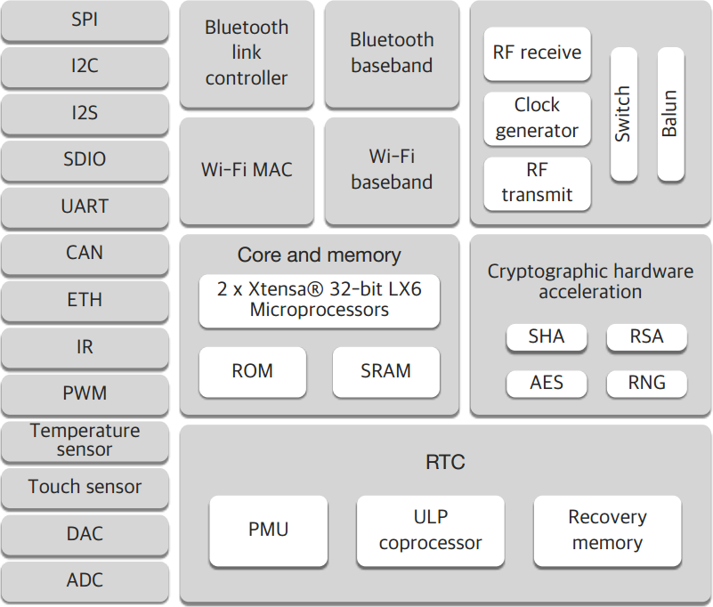

.. _iot-bus-platforms:

Platforms
----------

.. _platform_espressif32:

Espressif32
===========

ESP-WROOM32 WiFi Bluetooth Combo Module

The ESP-WROOM-32 WiFi Bluetooth combo module is ultra high performance and ultra low-power consumption FCC-approved (2AC7Z-ESPWROOM32) Wi-Fi and Bluetooth combo wireless platform based on ESPRESSIF ESP32 chipset. It integrates a dual-core processor, 448 KByte ROM,520 KByte SRAM,16 KByte SRAM in RTC, 802.11 b/g/n/e/I Wi-Fi, Bluetooth v4.2 BR/EDR & BLE, clocks & Times, abundant peripheral Interfaces and security mechanism.

The ESP-WROOM-32 WiFi Bluetooth combo module provides SDK Firmware for fast on-line programming and open source toolchains based on GCC for development support. It is designed for Generic low power IoT sensor hub, loggers, video steaming for camera, Wi-Fi & Bluetooth enabled devices, Home automation and mesh network applications, aimed at makers, hardware engineers, software engineers and solution provides. ESP32 is a single chip 2.4 GHz Wi-Fi and Bluetooth combo chip designed with TSMC ultra low power 40 nm technology. It is designed and optimized for the best power performance, RF performance, robustness, versatility, features and reliability, for a wide variety of applications, and different power profiles.

ESP32 is the most integrated solution for Wi-Fi + Bluetooth applications in the industry with less than 10 external components. ESP32 integrates the antenna switch, RF balun, power amplifier, low noise receive amplifier, filters, and power management modules. As such, the entire solution occupies minimal Printed Circuit Board (PCB) area. ESP32 is designed for mobile, wearable electronics, and Internet of Things (IoT) applications. It has many features of the state-of-the-art low power chips, including fine resolution clock gating, power modes, and dynamic power scaling. 

Espressif32 Key Features
-------------------------

Core
      • CPU and Memory: Xtensa® 32-bit LX6 Dua-core processor, up to 600 DMIPS.
      • 448 KByte ROM
      • 520 KByte SRAM
      • 16 KByte SRAM in RTC.
      • QSPI can connect up to 4* Flash/SRAM, each flash should be less than 16 MBytes.
      • Supply Voltage: 2.2V~3.6V
 
WiFi
      • 802.11 b/g/n/e/i
      • 802.11 n (2.4 GHz), up to 150 Mbps
      • 802.11 e: QoS for wireless multimedia technology.
      • WMM-PS, UAPSD
      • MPDU and A-MSDU aggregation
      • Block ACK
      • Fragmentation and de-fragmentation
      • Automatic Beacon monitoring/scanning
      • 802.11 i security features: pre-authentication and TSN
      • Wi-Fi Protected Access (WPA)/WPA2/WPA2-Enterprise/Wi-Fi Protected Setup (WPS)
      • Infrastructure BSS Station mode/SoftAP mode
      • Wi-Fi Direct (P2P), P2P Discovery, P2P Group Owner mode and P2P Power Management
      • UMA compliant and certified
      • Antenna diversity and selection
 
Bluetooth
      • Compliant with Bluetooth v4.2 BR/EDR and BLE specification
      • Class-1, class-2 and class-3 transmitter without external power amplifier
      • Enhanced power control
      • +10 dBm transmitting power
      • NZIF receiver with -98 dBm sensitivity
      • Adaptive Frequency Hopping (AFH)
      • Standard HCI based on SDIO/SPI/UART ? High speed UART HCI, up to 4 Mbps
      • BT 4.2 controller and host stack
      • Service Discover Protocol (SDP)
      • General Access Profile (GAP)
      • Security Manage Protocol (SMP)
      • Bluetooth Low Energy (BLE)
      • ATT/GATT
      • HID
      • All GATT-based profile supported
      • SPP-Like GATT-based profile
      • BLE Beacon
      • A2DP/AVRCP/SPP, HSP/HFP, RFCOMM
      • CVSD and SBC for audio codec
      • Bluetooth Piconet and Scatternet
 
Clocks and Timers
      • Internal 8 MHz oscillator with calibration
      • Internal RC oscillator with calibration
      • External 2 MHz to 40 MHz crystal oscillator
      • External 32 kHz crystal oscillator for RTC with calibration
      • Two timer groups, including 2 x 64-bit timers and 1 x main watchdog in each group
      • RTC watchdog
 
Peripheral Interface
      • 12-bit SAR ADC up to 18 channels
      • 2 × 8-bit D/A converters
      • 10 × touch sensors
      • Temperature sensor
      • 4 × SPI, 2 × I2S, 2 × I2C, 3 × UART
      • 1 host (SD/eMMC/SDIO), 1 slave (SDIO/SPI)
      • Ethernet MAC interface with dedicated DMA and IEEE 1588 support
      • CAN 2.0
      • IR (TX/RX)
      • Motor PWM, LED PWM up to 16 channels
      • Hall sensor
      • Ultra low power analog pre-amplifier
 
Security
      • IEEE 802.11 standard security features all supported, including WFA, WPA/WPA2 and WAPI
      • Secure boot
      • Flash encryption
      • 1024-bit OTP, up to 768-bit for customers
      • Cryptographic hardware acceleration: -AES-HASH(SHA-2) library-RSA-ECC-Random Number Generator (RNG)
