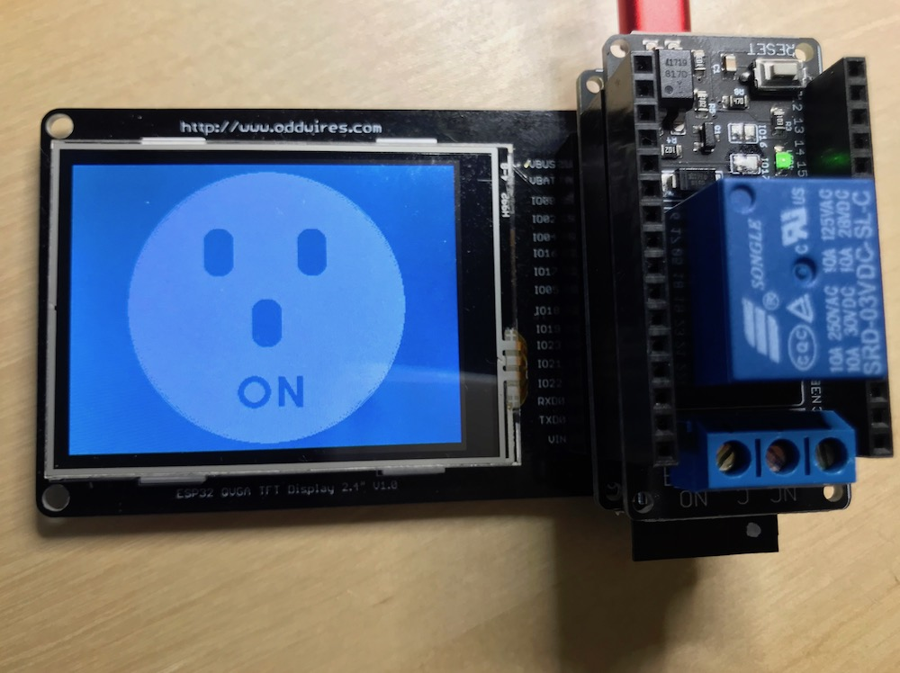

.. _mozilla_iot_examples_index:

IoT-Bus Mozilla IoT Examples
============================

These examples are designed to run on IoT-Bus boards by oddWires. In each case, they demonstrate how to create a mozilla-iot "thing" and expose it through the mozilla-iot 
gateway running on a raspberry pi on the same Wi-Fi network. We will refer to a mozilla-iot thing as a Thing in this 
document. To setup a gateway see 
`this link <https://hacks.mozilla.org/2018/02/how-to-build-your-own-private-smart-home-with-a-raspberry-pi-and-mozillas-things-gateway/>`_. 
You can find the examples on GitHub at `IoT-Bus <https://github.com/iot-bus>`_. There are two repositories:

`iot-bus-mozilla-iot-examples-platformio <https://github.com/iot-bus/iot-bus-mozilla-iot-examples-platformio>`_
    Examples in PlatformIo format. A platformio.ini file is included with library dependencies.

`iot-bus-mozilla-iot-examples-arduino <https://github.com/iot-bus/iot-bus-mozilla-iot-examples-arduino>`_
    Examples in ino format. You will need to install required libraries separately.

In each example you will have to enter your ssid and password within the main cpp file otherwise you will not reach the gateway. 
You can find the code for all the examples on github `here <https://github.com/iot-bus/iot-bus-mozilla-iot-examples>`_.

.. code-block:: none

    //TODO: Hardcode your wifi credentials here (and keep it private)
    const char* ssid = "........";
    const char* password = "........";

The typical platformio.ini for mozilla-iot contains:

.. code-block:: ini
    
    [env:iotbusio]
    platform = espressif32
    board = iotbusio
    framework = arduino

    ; Serial Monitor options
    monitor_speed = 115200

    ; Library dependencies
    lib_deps = ArduinoJson
            https://github.com/me-no-dev/ESPAsyncWebServer
            https://github.com/mozilla-iot/webthing-arduino
            

If you are using a display, this would be the platformio.ini required:

.. code-block:: ini

    [env:iotbusio]
    platform = espressif32
    board = iotbusio
    framework = arduino

    ; Serial Monitor options
    monitor_speed = 115200

    ; Library dependencies inclduing tft and touchscreen
    lib_deps = ArduinoJson
            https://github.com/me-no-dev/ESPAsyncWebServer
            https://github.com/mozilla-iot/webthing-arduino
            https://github.com/iot-bus/XPT2046_Touchscreen
            https://github.com/iot-bus/TFT_eSPI

Of course if you are using other libraries for sensors or your own, 
you can include them here and PlatformIO will locate and install them.            

:ref:`LED Thing <mozilla-iot-bus-led-thing>`
    This example creates a Thing that enables the built-in LED on GPIO5 to be set through the mozilla-iot domain.

:ref:`LED Lamp Thing <mozilla-iot-bus-ledlamp-thing>`
    This example creates a Thing that enables the status and brightness of the built-in LED on GPIO5 to be set through the mozilla-iot domain.

:ref:`DHT11 Thing <mozilla-iot-bus-dht11-thing>`
    This example creates a Thing that exposes temperature and humidity properties and also displays the temperature locally.

    Connect a DHT11 Temperature Sensor and run:

    .. code-block:: none  

        DATA -> GPIO4
        VCC  -> VUSB (VIN is OK if using battery(3.7-42V) but not 3V3 as not high enough)
        GND  -> GND

:ref:`HC-SR04 Thing <mozilla-iot-bus-hcsr04-thing>`
    This example creates a Thing that exposes the current distance reading or the HC-SR04 ultrasonic distance sensor and also displays the distance locally.

    Connect an HC-SR04 Ultrasonic Distance Sensor and run:

    .. code-block:: none  

        TRIG -> GPIO2
        ECHO -> GPIO4
        VCC  -> VUSB
        GND  -> GND (VIN is OK if using battery(3.7-42V) but not 3V3 as not high enough)

:ref:`HC-SR501 PIR Thing <mozilla-iot-bus-hcsr501-pir-thing>`
    This example creates a motion sensor Thing that triggers on movement. It sets the on-board LED on triggering and updates the mozilla-iot interface appropriately.
    Connect an HC-SR501 Passive Infrared Sensor or any similar device and run:

    .. code-block:: none  

        OUT  -> GPIO4 
        VCC  -> VUSB (Typically VIN is OK if using battery(3.7-42V) but not 3V3 as not high enough)    
        GND  -> GND 

:ref:`Touch Thing <mozilla-iot-bus-touch-thing>`
    This example creates a touch switch Thing that triggers when one of the capacitive touch pins on the ESP32 are touched. It sets the on-board LED on triggering and updates the mozilla-iot interface appropriately.

    Connect a wire to GPIO4 and run.   

:ref:`Calculator Thing <mozilla-iot-bus-calculator-thing>`   
    This example is a simple integer calculator that creates a Thing that exposes the two numbers, 
    the last function and the result. It requires the IoT-Bus display.

:ref:`Door Sensor Thing <mozilla-iot-bus-window-door-sensor-thing>`  
    This example shows how to use a typical magnetic door sensor. Just connect one side of the contacts to GPIO4 and the other to GND. When the contacts are open the door sensor will show open in the mozilla interface and when they are shut the door will show shut.

:ref:`Relay Thing <mozilla-iot-bus-relay-thing>`   
    This example uses an IoT-Bus relay board together with an IoT-Bus Io processor to expose the relay status 
    and to enable the user to change through your mozilla-iot domain. 

:ref:`Relay Display & Touch Switch Thing <mozilla-iot-bus-relay-display-touch-thing>`
    In this second relay example the current status of the relay is also shown on the display. The touchscreen is enabled so it can be switched 
    on and off locally. The status will be reflected by mozilla-iot.