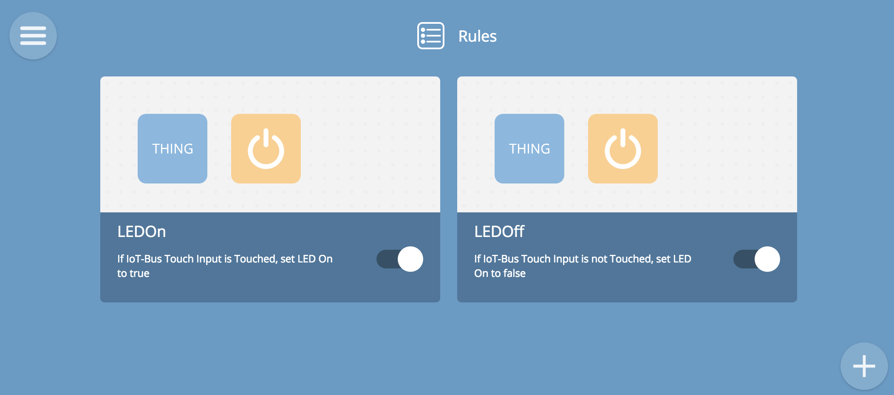
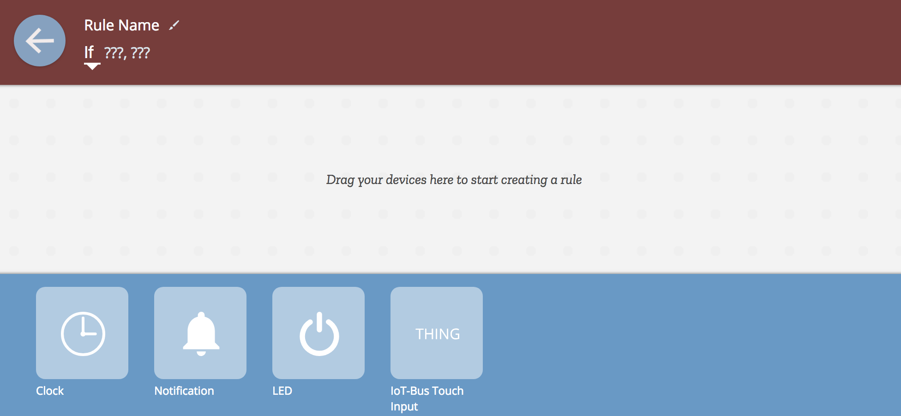
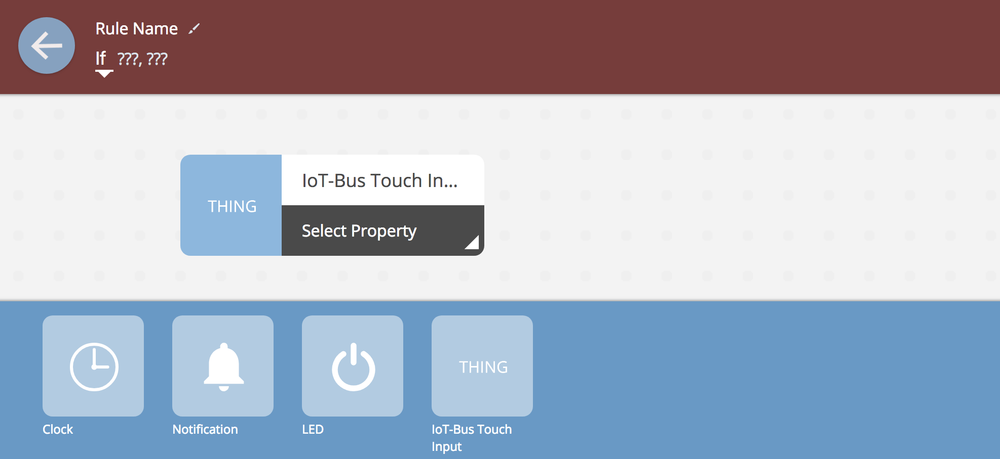
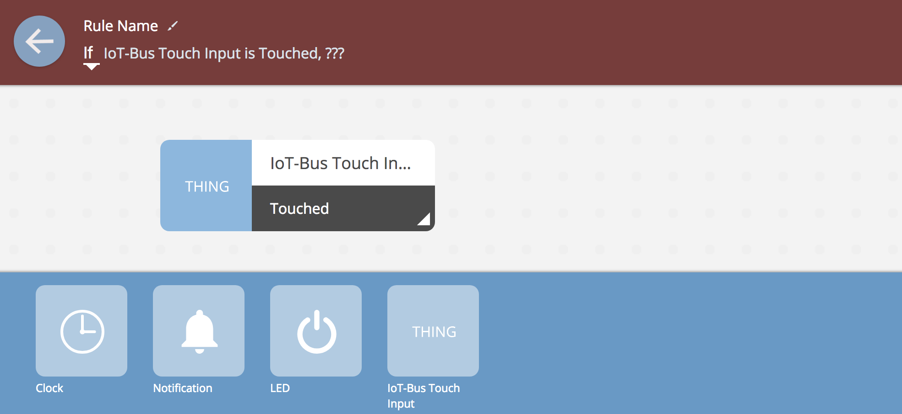
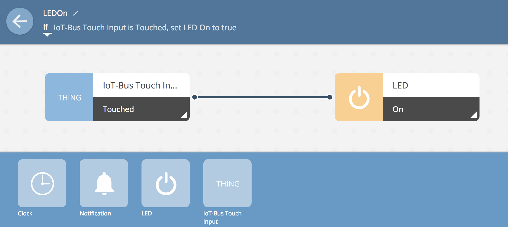
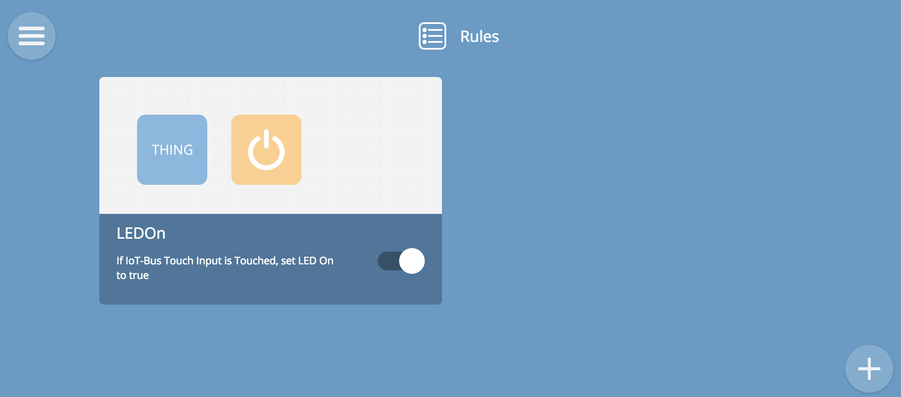
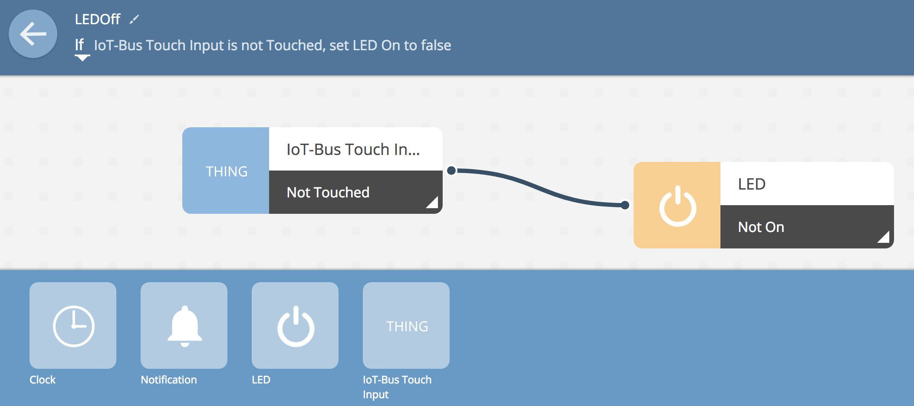

.. _iot-bus-mozilla-rules-engine:

Mozilla Rules Engine
--------------------

In this tutorial we'll use the the Mozilla Things created in the previous two tutorials, the Touch Thing and the LED Thing. 
We're going to use the Rules Engine to use the input from one Thing ,the Touch Thing to control the other , the lED Thing.
What we want to do is have the LED Thing on when we hold the Touch wire on the other Thing and off when when we release it.

So we are going to create two rules. 

This is what the rules engine will look like when we're finished.

Let's get started. It's a very easy process. Use the menu icon in the top left corner to select the rules engine. You'll 
see this screen:

Click the add button on the bottom right and you'll see this:    

You should be able to see the devices LED and IoT-Bus Touch Input. If you can't, 
you'll need to go back and add them according to the two previous tutorials.   

Creating a rule is a drag and drop or a point and click section process. Drag the Touch Input icon from the bar on the bottom and move it up and to the left
into the input box.    

The select the Touched property from the choices given when you select the bottom right hand corner of the rule icon. 
In a similar fashion drag the LED icon to thr right, output box and select the On property. When you've done that you've connected the 
two properties on their respective devices into a rule. Name the rule something useful like LEDOn or Touched or whatever you like.

If you step back out of rule editing, the rule should look like this:    

In a similar fashion add the second rule for not touched / LED off.    

Once you have done that, you should see the finished result. Now when you touch the wire on one Thing, 
the status is reflected on the other Thing by the on-board LED. Easy!

                  